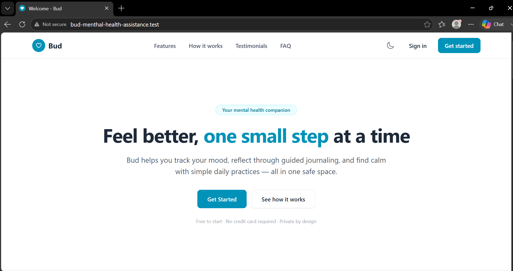
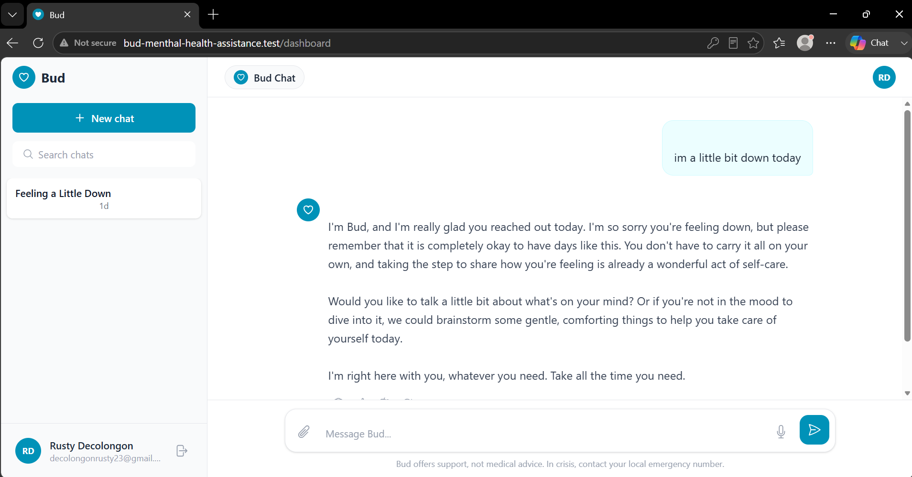

# Bud — Mental Health Assistance

> Your mental health companion. Feel better, one small step at a time.

Bud helps you track your mood, reflect through guided journaling, and find calm with simple daily practices — all in one safe space.

Free to start · No credit card required · Private by design

## Screenshots

### Landing Page

*Welcome / landing page — hero section with "Feel better, one small step at a time"*

### Bud Chat — Dashboard

*Authenticated dashboard — empathetic AI chat. Example: "im a little bit down today" → supportive response from Bud.*


## Features

- **Mood Tracking** — daily check-ins and history
- **Guided Journaling** — reflective prompts powered by AI (Laravel AI / Gemini)
- **Bud Chat** — empathetic conversational support, not medical advice
- **Private by design** — conversations scoped per user via `Laravel\Ai\Models\Conversation`
- **Livewire 4 + Tailwind** — reactive UI without a JS SPA

## How It Works

1. Sign in and start a new chat from the sidebar (`+ New chat`)
2. Share how you're feeling — Bud responds with supportive, non-clinical guidance
3. Search and revisit past chats ("Feeling a Little Down") — stored via `DashboardService` + `ConversationStore`

## Tech Stack

- **PHP 8.4 / Laravel 13.26.1**
- **Livewire 4**
- **Laravel AI** (`laravel/ai`) — `Gemini` as default provider (`config/ai.php:16`, `app/Services/DashboardService.php:35,59`)
- **Tailwind CSS + Vite**
- **MySQL / Cache / Session** — database-backed

## Getting Started

```bash
cp .env.example .env
composer install
npm install
php artisan key:generate
php artisan migrate
npm run build # or npm run dev
php artisan serve
# App served via Laravel Herd at http://bud-menthal-health-assistance.test
```

Set your AI key in `.env`:

```env
GEMINI_API_KEY=your_key_here
# optional failover providers
# ANTHROPIC_API_KEY=
# OPENAI_API_KEY=
```

> If Gemini is overloaded (503 `ProviderOverloadedException`), configure failover or retry in `app/Services/DashboardService.php` — free-tier Gemini is rate-limited and more prone to 503s during spikes.

## Project Structure

- `app/Services/DashboardService.php` — chat orchestration via `MentalHealthAgent`
- `app/Ai/Agents/MentalHealthAgent.php` — agent prompt & instructions
- `app/Livewire/Dashboard.php` — Livewire component for `/dashboard`
- `resources/views/` — Blade + Livewire views
- `config/ai.php` — provider configuration

## Disclaimer

Bud offers support, not medical advice. In crisis, contact your local emergency number.

## License

MIT — see original Laravel Starter Kit license.

## Contributing

Contributions via [Maestro](https://github.com/laravel/maestro) per Laravel Starter Kit guidelines.
